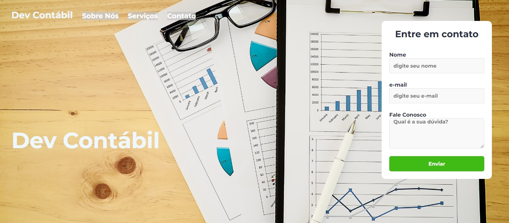

# DevContabil

> Esse é um modelo de site para contabilidade com descrição dos serviços e uma caixa de inputs para captação de leads.

### Ajustes e melhorias

O projeto ainda está em desenvolvimento e as próximas atualizações serão voltadas nas seguintes tarefas:

- [ ] Tarefa 1 - tornar esponsivo
- [ ] Tarefa 2 - melhorar o design dos elementos
- [ ] Tarefa 3 - trocar plano de fundo

## 🤝 Colaboradores

Agradecemos às seguintes pessoas que contribuíram para este projeto:

<table>
  <tr>
    <td align="center">
      <a href="#"> 
         
        
          <a href="https://www.linkedin.com/in/anderson-oliva/" >Anderson Oliva</a>
        
      </a>
    </td>
    <td align="center">
    </td>
    <td align="center">
      <a href="#">
         
        
          <a href="https://www.linkedin.com/in/rodolfomori/" >Rodolfo Mori</a>
        
      </a>
    </td>
  </tr>
</table>

